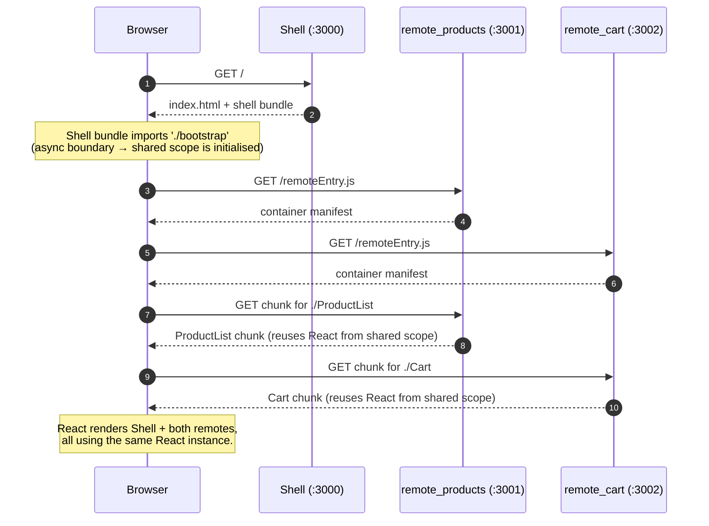
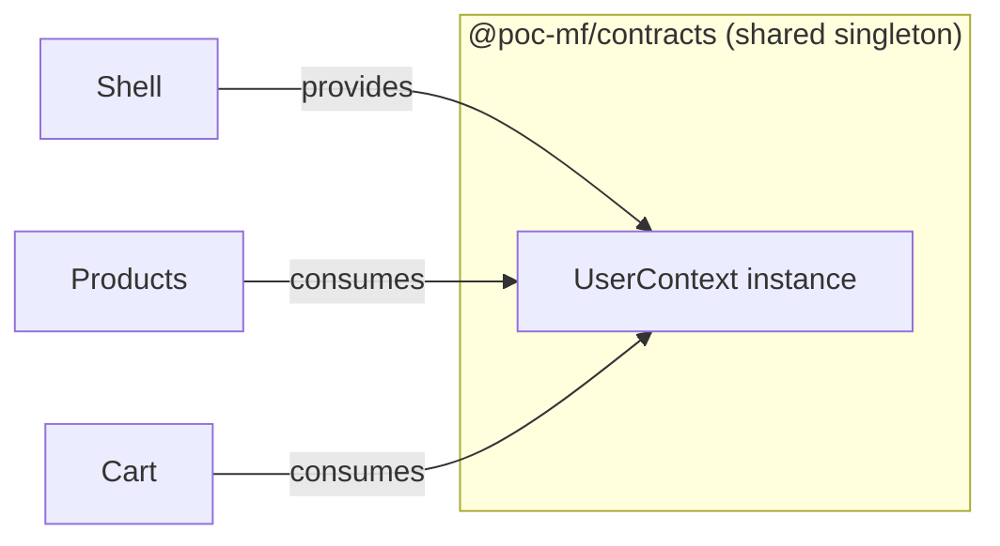

# Architecture

This document explains *how* the pieces fit together and *why* each decision was made. Read the root `README.md` first for the high-level overview and commands.

## 1. Terminology

- **Host (a.k.a. shell):** the application that orchestrates the page and consumes code from remotes. In this repo: `apps/shell`.
- **Remote (a.k.a. module):** a standalone application that exposes components for hosts to load. In this repo: `modules/remote-products` and `modules/remote-cart`.
- **`remoteEntry.js`:** the small manifest file each remote publishes. It tells the host what modules are exposed, what chunks to fetch for each, and what shared dependencies the remote expects.
- **Shared scope:** a runtime registry (one per page) where singletons like `react` are registered so every container pulls the same instance.

## 2. End-to-end flow



Key point: the host bundle **does not** contain the remotes. Their code only enters the page when `React.lazy(() => import('remote_products/ProductList'))` fires.

## 3. Why `index.ts → import('./bootstrap')`?

Module Federation can only give you singletons if it has a chance to run its runtime *before* your application touches `react`. The idiom is a two-file entry:

- `src/index.ts` contains exactly `import('./bootstrap')` — an **async** import.
- `src/bootstrap.tsx` contains the actual `createRoot(...)` call.

The async boundary is the hook Rspack uses to inject its "initialise the shared scope" code. Without it you typically get a confusing `Shared module is not available for eager consumption` error.

The shell declares `react` and `react-dom` with `eager: true` because it is the container that boots first; remotes declare them **without** `eager` so they reuse the host's instance rather than pulling their own.

## 4. Isolation model

| Concern            | Mechanism                                                                 |
| ------------------ | ------------------------------------------------------------------------- |
| Code isolation     | Each package is its own workspace with its own `rspack.config.js`, `tsconfig.json`, and `dist/`. |
| Dependency control | Each `package.json` pins its own deps. npm workspaces hoists where safe; lockfile is a single file at the root. |
| Deploy isolation   | Each `dist/` can be published to a different origin/CDN. The host only needs the URLs to the `remoteEntry.js` files. |
| Failure isolation  | The shell wraps every remote in `<Suspense>` and a class-based `RemoteErrorBoundary`. A remote that fails to load shows a red panel; the rest of the shell keeps working. |
| State isolation    | Each remote owns its React state (`useState`). Nothing crosses the boundary unless the shell passes it in as a prop. |

What is **not** isolated — intentionally:

- `react` / `react-dom` are **shared singletons**. That is a hard requirement: two React instances on the same page cause broken hooks, context that doesn't cross boundaries, and subtle re-render bugs.

## 5. Rspack configuration highlights

Same shape in all three packages (see each `rspack.config.js`):

- `entry: './src/index.ts'` — the async-boundary entry.
- `output.publicPath: 'auto'` — lets a remote be served from any origin without hard-coding URLs into chunk requests.
- `output.uniqueName` — must differ between containers to avoid webpack-runtime collisions on the same page.
- `builtin:swc-loader` — Rspack's built-in SWC, no Babel required.
- `experiments.css: true` + `type: 'css'` — Rspack's native CSS handling.
- `devServer.headers['Access-Control-Allow-Origin'] = '*'` — remotes must serve their chunks with permissive CORS so the host can fetch them from a different origin.
- `ModuleFederationPlugin` from `@module-federation/enhanced/rspack` (MF 2.0), not the one in `@rspack/core`. MF 2.0 adds dynamic type support, better DX, and a stable runtime API.

## 6. The shell's consumer API

```
import('remote_products/ProductList')
```

The string `remote_products/ProductList` is **not** a file path. It is a federated module specifier of the form `<remote alias from remotes config>/<exposes key>`. Rspack rewrites the import at build time into code that:

1. Ensures the shared scope is initialised.
2. Fetches `http://localhost:3001/remoteEntry.js` if it hasn't been loaded yet.
3. Calls the container's `get('./ProductList')` to obtain a factory.
4. Fetches the chunk the factory points at and resolves the Promise.

Because this is just `import()`, all of React's async primitives (`React.lazy`, `<Suspense>`) work out of the box.

TypeScript doesn't know about these virtual modules, so `apps/shell/src/remotes.d.ts` declares their shapes as ambient modules. If you expose a new component, update that file too.

## 7. Sharing React Context across bundles

React Context connects a `<Provider>` to a `useContext(...)` by **object identity**. Sharing `react` as a singleton is not enough on its own — each workspace that calls `createContext()` would produce a different context object unless the module containing that call is also shared.

This repo solves that with a dedicated workspace, `packages/contracts` (`@poc-mf/contracts`), which:

1. Holds the single `createContext()` call, the `UserProvider`, and the `useUser()` hook.
2. Is declared as `{ singleton: true }` in **every** MF config — shell *and* both remotes.
3. Is marked `eager: true` in the shell only, because the shell renders the provider during initial paint.



At runtime the MF shared scope resolves `@poc-mf/contracts` to a single module instance. All three containers get the same `UserContext` object → the provider in the shell connects to the consumers in the remotes.

### Build-time integration

- `packages/contracts` ships TypeScript source (no build step). Its `package.json` sets `"main": "src/index.ts"` and `"types": "src/index.ts"`.
- npm workspaces symlinks it into `node_modules/@poc-mf/contracts`. With `resolve.symlinks: true` (Rspack's default), the loader sees the real path under `packages/contracts/src/`, which is **outside** `node_modules/`. The existing `exclude: /node_modules/` rule on `builtin:swc-loader` therefore still compiles it — no config change needed.
- `requiredVersion: false` in the shared config tells MF not to compare semver (useful for internal workspace packages with a `*` dep range).

### Standalone mode

Each remote's `bootstrap.tsx` wraps its exposed component in `<UserProvider>` with a dev-only initial user. That way:

- `npm run dev:products` works without the shell — `useUser()` has a provider to connect to.
- In production (consumed via the shell), the shell's `<UserProvider>` takes over because remotes never pull in their own `bootstrap.tsx` when federated.

### Common pitfalls to avoid

- **Forgetting `singleton: true`** on any one workspace → silent bifurcation; the provider and consumer wire up to different context objects and `useUser()` reads `null`.
- **Defining context inside an exposed component** (instead of the shared package) → each host gets its own copy, defeating the whole scheme.
- **Version drift.** If you later add a real version to `@poc-mf/contracts` and pin different `requiredVersion`s per workspace, MF may reject one of the copies at runtime. Keep them aligned or keep `requiredVersion: false`.
- **Missing `eager: true` in the host.** The shell renders the provider synchronously during first paint; without `eager` you get a `Shared module is not available for eager consumption` error.

## 8. Known limitations of this POC

- **Hard-coded remote URLs.** Production setups typically fetch remote URLs from a registry or environment variable. Swap in `@module-federation/runtime` `init(...)` + `loadRemote(...)` if you need dynamic remotes.
- **No CI.** No test runner, no linter, no workflow files.
- **No production deploy story.** `npm run serve` is a local static-file trick, not a CDN.
- **No type contract beyond hand-written `.d.ts`.** For shared component APIs, consider MF 2.0's generated `@mf-types/` folder (`dts: true` in the MF config) or a dedicated `@poc-mf/contracts` package.
- **No cross-remote communication.** If the cart needed to react to product selections, add a shell-owned event bus or state store and pass it to remotes as props.
